# Social Clipboard Setup Instructions

## Prerequisites
- An AWS account
- A key-value pair for SSH access
- A registered domain name (e.g., `omotolani.tech`)

---

## 1. Launch an EC2 Instance
1. Log in to the [AWS Management Console](https://console.aws.amazon.com).
2. In the search bar, type `EC2` and select **EC2** from the results.
3. Click on the **Launch Instance** button.
4. Configure the instance:
   - Choose the operating system (Ubuntu is recommended).
   - Set vCPU, memory, storage, and network configurations.
5. Launch the instance with the key-value pair for SSH access.

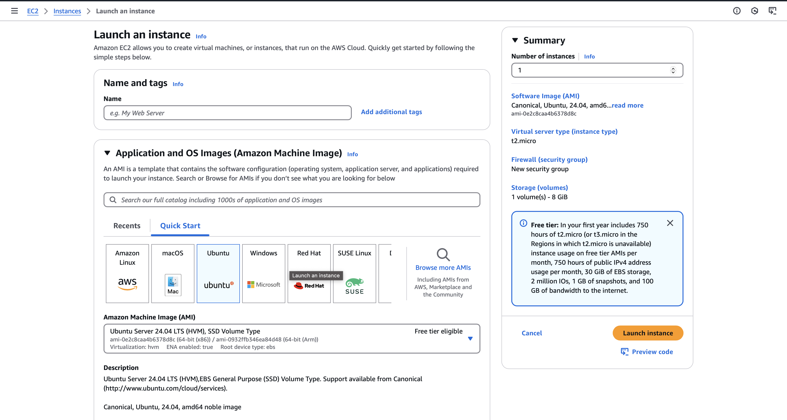
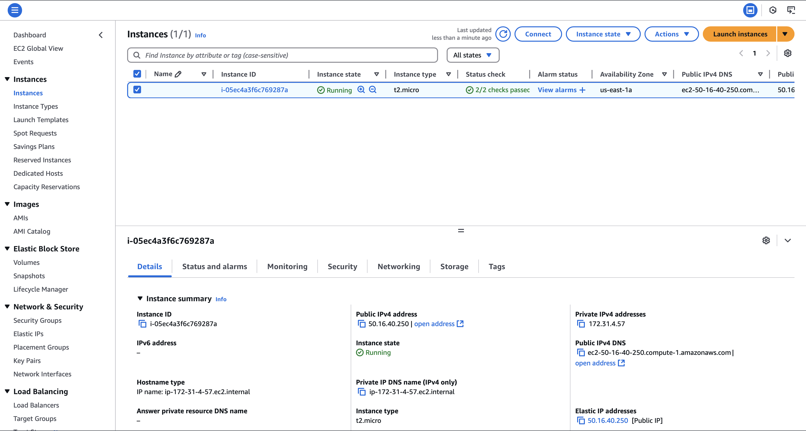

---

## 2. Allocate and Associate an Elastic IP
1. Navigate to the **Elastic IPs** section in the EC2 dashboard.
2. Click **Allocate Elastic IP Address** and fill out the necessary form.
3. Once allocated, click on **Actions** → **Associate IP Address**.
4. Select the running EC2 instance and its private IP.
5. Click **Associate** to complete the process.

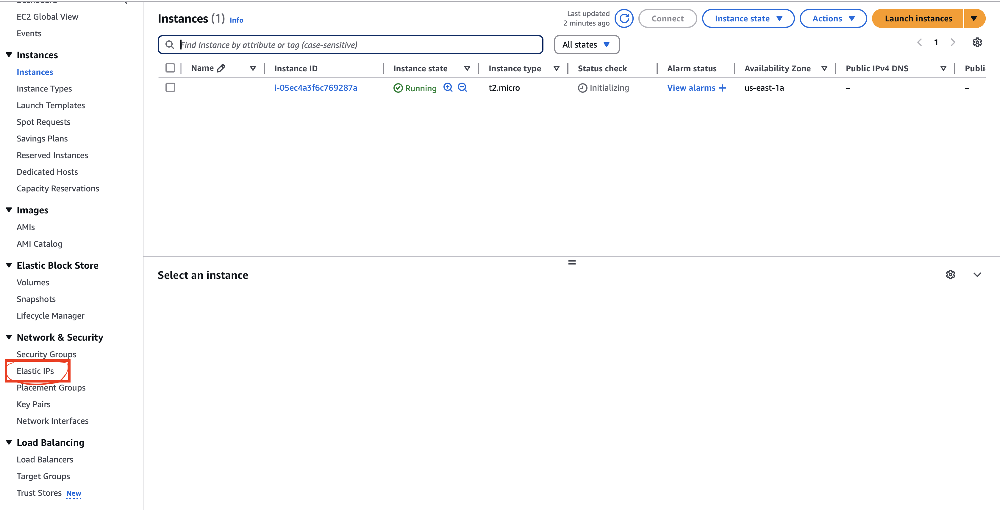
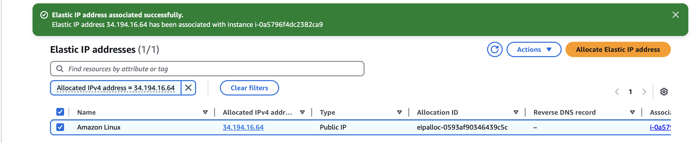
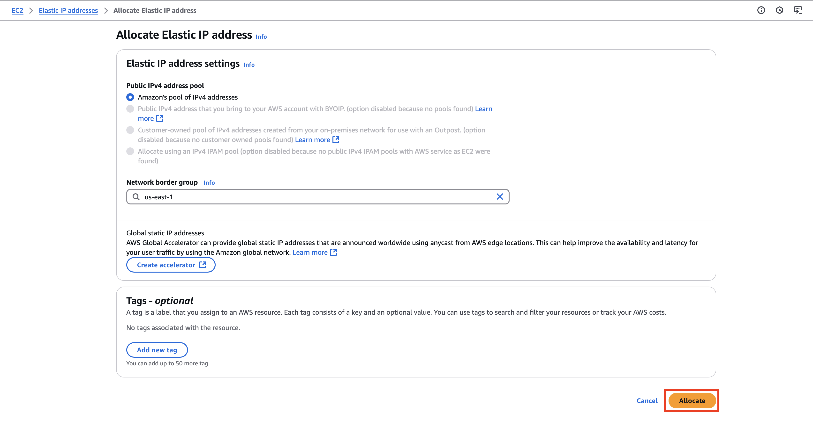
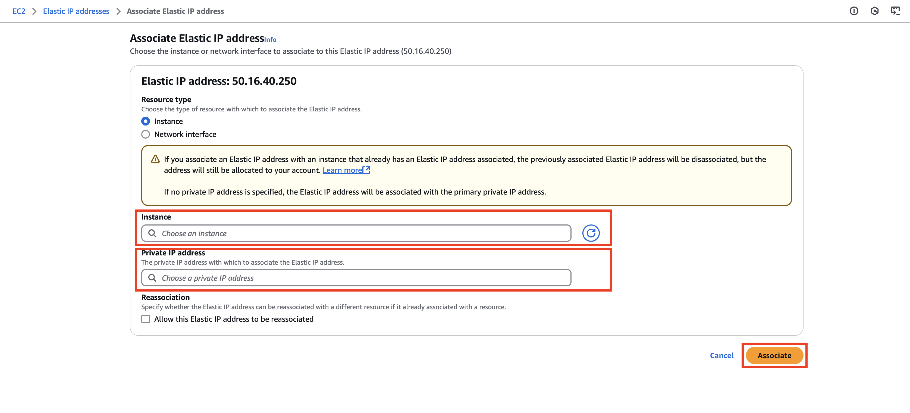
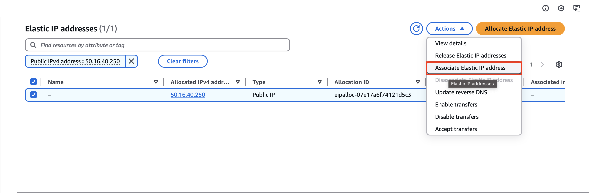

---

## 3. SSH into the Instance
Use the Elastic IP to access your instance:
```bash
ssh -i <path_to_key_pair> ubuntu@54.225.168.255
```

---

## 4. Install Nginx
1. Update the package list:
   ```bash
   sudo apt update && sudo apt upgrade
   ```
2. Install Nginx:
   ```bash
   sudo apt install nginx
   ```
3. Confirm that Nginx is running:
   ```bash
   systemctl status nginx
   ```

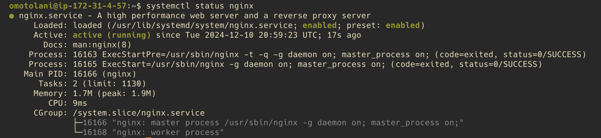

---

## 5. Configure a Virtual Host
1. Create a new configuration file for your project:
   ```bash
   sudo nano /etc/nginx/sites-available/social.clip.conf
   ```
2. Add the following server configuration:
   ```nginx
   server {
       listen 80;
       listen [::]:80;

       server_name social.omotolani.tech;

       root /var/www/social.clip;
       index index.html;

       location / {
           try_files $uri $uri/ =404;
       }
   }
   ```
3. Test the configuration:
   ```bash
   sudo nginx -t
   ```
4. Enable the virtual host by creating a symbolic link:
   ```bash
   sudo ln -s /etc/nginx/sites-available/social.clip.conf /etc/nginx/sites-enabled/
   ```
5. Restart Nginx to apply changes:
   ```bash
   sudo systemctl restart nginx
   ```

<!--  -->

---

## 6. Set Up the Web Root
1. Navigate to the web root directory:
   ```bash
   cd /var/www
   ```
2. Create a new folder for your project:
   ```bash
   sudo mkdir social.clip
   cd social.clip
   ```
3. Create an `index.html` file:
   ```bash
   sudo nano index.html
   ```
4. Add content to the `index.html` file (e.g., a placeholder message).

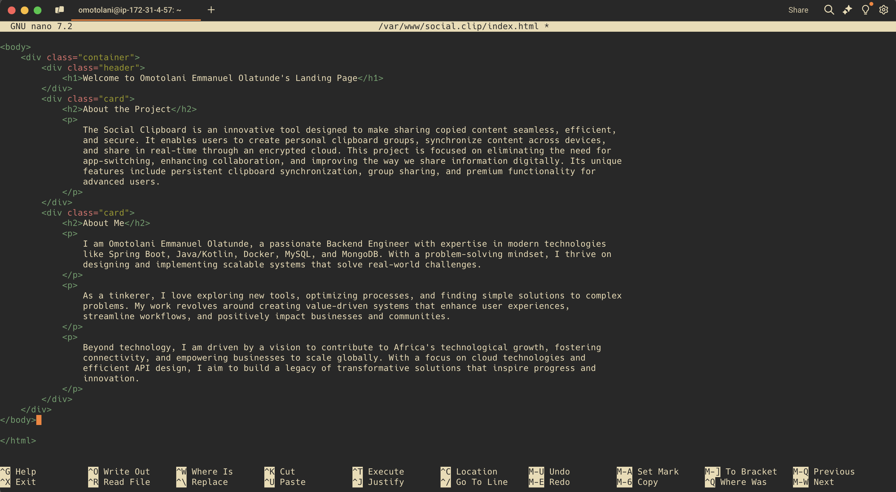

---

## 7. Update DNS Records
1. Log in to your domain registrar's dashboard.
2. Add an **A Record** for `social.omotolani.tech` pointing to your Elastic IP.
3. Save the DNS changes and allow time for propagation.

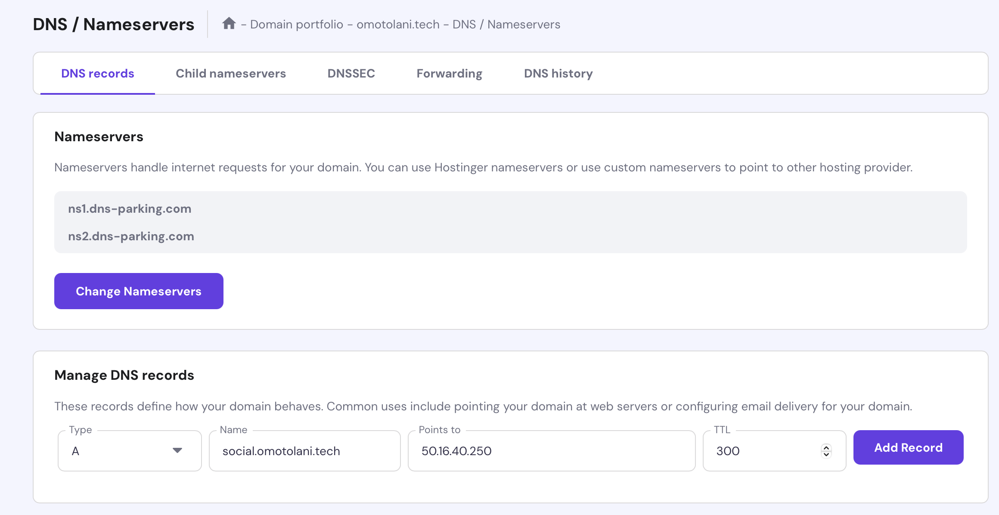

---

## 8. Secure the Nginx Server with SSL
1. Install Certbot:
   ```bash
   sudo apt install certbot python3-certbot-nginx -y
   ```
2. Verify the installation:
   ```bash
   certbot --version
   ```
3. Obtain an SSL certificate:
   ```bash
   sudo certbot --nginx -d social.omotolani.tech
   ```
4. Update the security group for your EC2 instance to allow HTTPS inbound traffic.

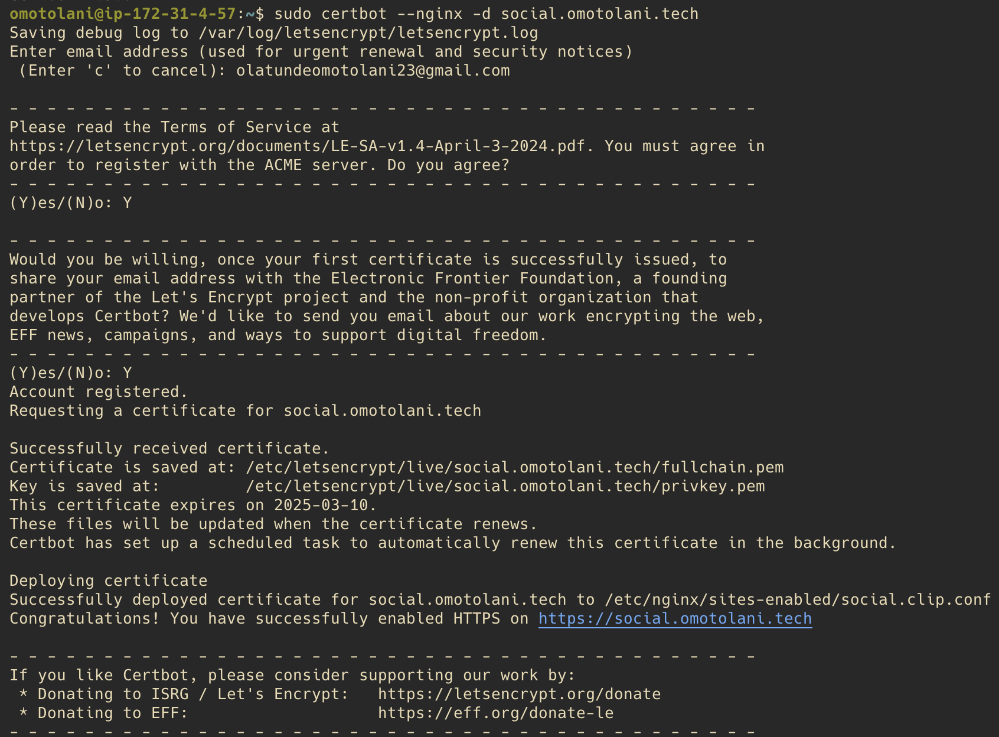

---
## 9. Accessing the URL
[Website Link](https://social.omotolani.tech)
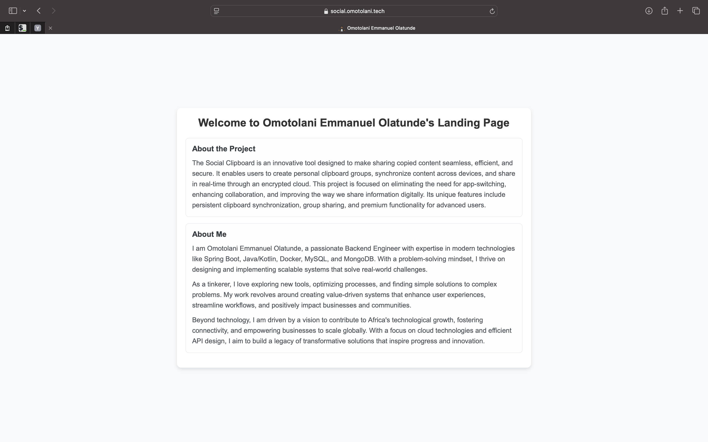
